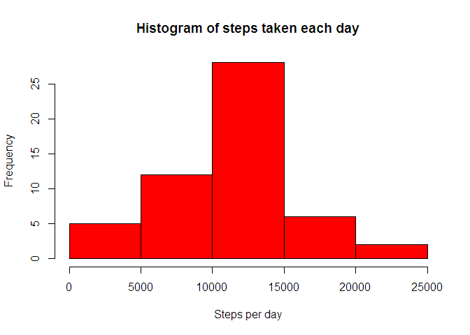
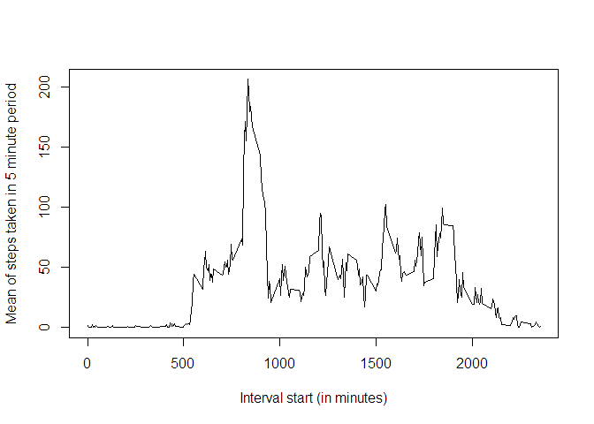
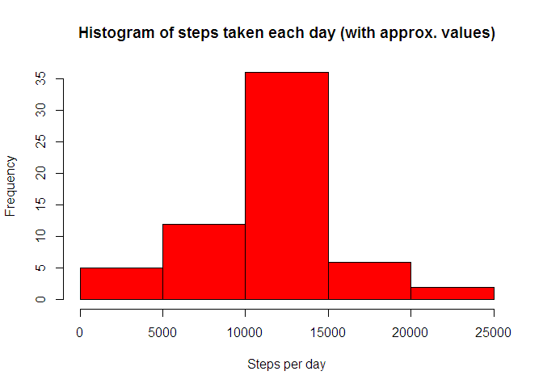
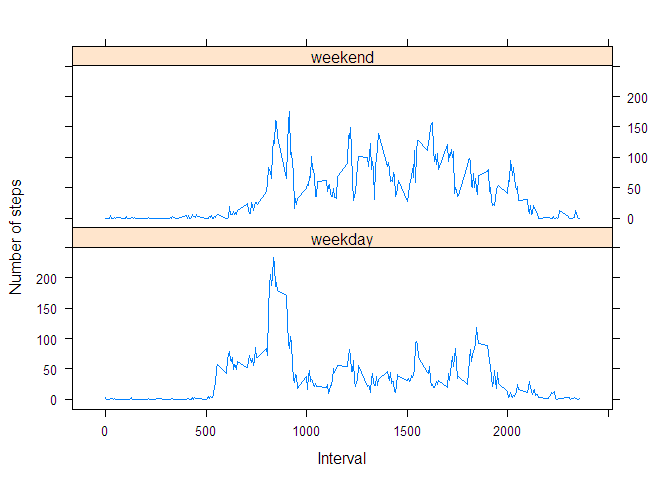

# Reproducible Research: Peer Assessment 1


## Loading and preprocessing the data


```r
setwd("E:/Coursera/Reproducible Research/Peer Assessment 1/Repo")
csv = read.csv("activity.csv", stringsAsFactors = FALSE)
names(csv) <- c("Steps", "Date", "Interval")
class(csv$Steps) <- "numeric"
```

## What is mean total number of steps taken per day?


```r
# Make a histogram of the total number of steps taken each day

# aggregate: add up the number of steps taken for each
# involved date to get the daily total values
daily.steps = aggregate(csv$Steps, by = list(Date = csv$Date), FUN = sum)

hist(as.numeric(daily.steps$x), xlab = "Steps per day", 
     main = "Histogram of steps taken each day",
     col = "red")
```

 

```r
# calculate the mean daily number of steps
mean(daily.steps$x, na.rm = TRUE)
```

```
## [1] 10766.19
```

```r
# calculate the median daily number of steps
median(daily.steps$x, na.rm = TRUE)
```

```
## [1] 10765
```

## What is the average daily activity pattern?

"Make a time series plot (i.e. type = "l") of the 5-minute interval 
(x-axis) and the average number of steps taken, averaged across all 
days (y-axis)""

To achieve this, aggregate averages for each involved time period.

A challenge to face is the presence of NA values - generally speaking 
replacing them with anything but the (true) mean distorts the calculated
value.
Removing them seems a viable option, do that.


```r
NA.Filter = !is.na(csv$Steps)
csv.Active = csv[NA.Filter, ]
all.days.mean = 
  aggregate(
    csv.Active$Steps,
    by = list(Interval = csv.Active$Interval), 
    FUN = mean)
plot(all.days.mean$Interval, all.days.mean$x, type = "l", 
     xlab = "Interval start (in minutes)", 
     ylab = "Mean of steps taken in 5 minute period")
```

 


```r
# Which 5-minute interval, on average across all the days in the dataset, 
# contains the maximum number of steps?

all.days.mean$Interval[
  which(max(all.days.mean$x) == all.days.mean$x)
]
```

```
## [1] 835
```

## Imputing missing values

1. "Calculate and report the total number of missing values in the dataset 
   (i.e. the total number of rows with NAs)"


```r
sum(is.na(csv$Steps))
```

```
## [1] 2304
```

2. "Devise a strategy for filling in all of the missing values in the dataset. 
   The strategy does not need to be sophisticated. For example, you could use 
   the mean/median for that day, or the mean for that 5-minute interval, etc.
3. Create a new dataset that is equal to the original dataset but with the 
   missing data filled in."

First thought: use the all day mean values for the intervals with missing 
values to workaround the missing values.

Check to see if there are any periods which are never
measured and thus could not be estimated in the proposed way:

```r
tail(cbind((all.days.mean$Interval %/% 5) + 1, all.days.mean))
```

```
##     (all.days.mean$Interval%/%5) + 1 Interval         x
## 283                              467     2330 2.6037736
## 284                              468     2335 4.6981132
## 285                              469     2340 3.3018868
## 286                              470     2345 0.6415094
## 287                              471     2350 0.2264151
## 288                              472     2355 1.0754717
```
.. and find that not all of them.


```r
# As the chart did not seem fully random, interpolation from the 
# averages can remedy this situation. 
# Estimate for all values in [min, max].
x.out = seq(min(csv$Interval), max(csv$Interval), by = 5)
est.all.day.means = approx(x = all.days.mean$Interval,
                           y = all.days.mean$x,
                           xout = x.out)$y
# To get a full data set, look up the values using
# (Interval / 5 + 1) as an index.
steps.with.approx = 
  ifelse(is.na(csv$Steps), 
         est.all.day.means[csv$Interval / 5 + 1],
         csv$Steps)
csv.with.approx = transform(csv, Steps = steps.with.approx)
head(csv.with.approx)
```

```
##       Steps       Date Interval
## 1 1.7169811 2012-10-01        0
## 2 0.3396226 2012-10-01        5
## 3 0.1320755 2012-10-01       10
## 4 0.1509434 2012-10-01       15
## 5 0.0754717 2012-10-01       20
## 6 2.0943396 2012-10-01       25
```

4. Make a histogram of the total number of steps taken each day and 
   Calculate and report the mean and median total number of steps taken 
   per day. Do these values differ from the estimates from the first part
   of the assignment? What is the impact of imputing missing data on the 
   estimates of the total daily number of steps?


```r
daily.steps.2 = aggregate(csv.with.approx$Steps, by = list(Date = csv$Date), 
                          FUN = sum)
hist(as.numeric(daily.steps.2$x), xlab = "Steps per day", 
     main = "Histogram of steps taken each day (with approx. values)",
     col = "red")
```

 

```r
mean(as.numeric(daily.steps.2$x))
```

```
## [1] 10766.19
```

```r
median(as.numeric(daily.steps.2$x))
```

```
## [1] 10766.19
```
Using a linear interpolation technique, the mean did not (visibly) change.
The median became the formerly different mean value.

## Are there differences in activity patterns between weekdays and weekends?


```r
# Create a new factor variable in the dataset with two levels - "weekday" and 
# "weekend" indicating whether a given date is a weekday or weekend day.
library(lubridate)
```

```
## Warning: package 'lubridate' was built under R version 3.2.2
```

```r
# Generate data for the weekly pattern.
# wday() gives 1 for Sunday and 7 for Saturday.
is.weekend = factor(
  as.integer(wday(csv.Active$Date) %in% c(1, 7)), 
  levels = c(0, 1), labels = c("weekday", "weekend")
)
# Add it to/set it on the data
csv.Active$Is.weekend <- is.weekend
# Calculate  the values for the plot
agg.data = aggregate(csv.Active$Steps, 
                     by = list(
                        Interval = csv.Active$Interval,
                        Is.weekend = csv.Active$Is.weekend
                     ),
                     FUN = mean
                     )

# Create a panel plot of the new data
library(lattice)
xyplot(data = agg.data, x ~ Interval | Is.weekend, type = "l", 
       ylab = "Number of steps", horizontal = TRUE, layout = c(1, 2))
```

 

Steps seems far less frequent over the middle of weekdays than those of 
weekends. Maybe due to sitting jobs?
